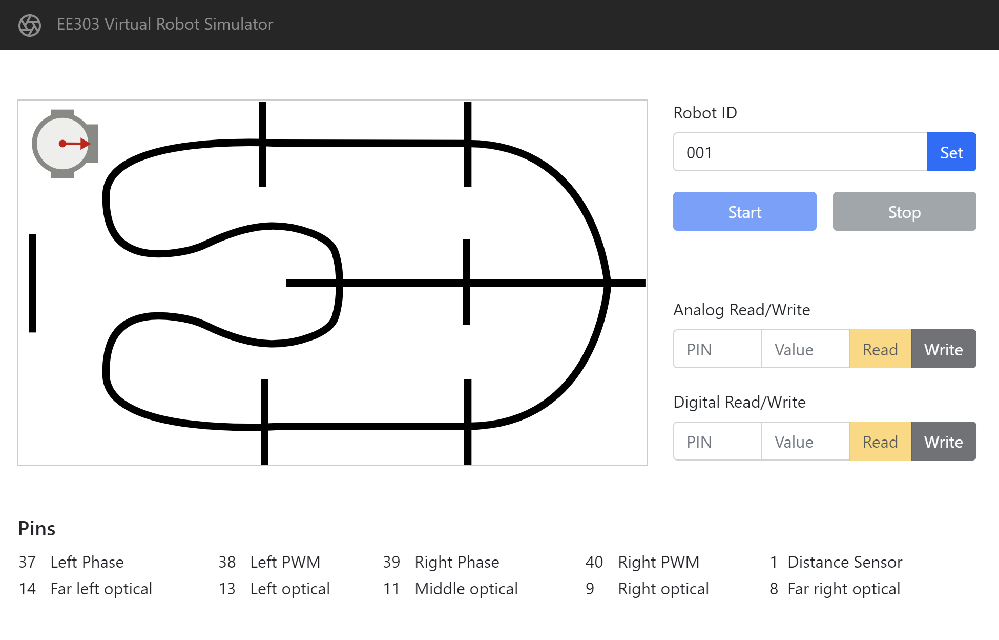

# ee303-vbotsvr


This is the simulator software for EE303. It is written in Javascript and Python, so you will need to install both NodeJS and Python 3 to run it.

## Prerequsites

- Install [NodeJS](https://nodejs.org/en/) 14.x LTS.
- Install Python 3. Probably the easiest way to install this is by downloading the [Anaconda Python distribution](https://www.anaconda.com/products/individual).


## Getting the code

You can use:
```
git clone https://github.com/kevinmcguinness/ee303-vbotsvr.git
```
if you have [git](https://github.com/kevinmcguinness/ee303-vbotsvr.git) installed on your machine. Otherwise, just use the green *Code* button in github to download a ZIP file and unpack it on your machine. 

## Setup

Run the following command from an terminal to install the necessary Python libraries. You may need to use the Anaconda Prompt to do this if you are using the Anaconda Python distribution.

```sh
    pip install -r requirements.txt
```

Also install the necessary node modules. In the terminal, navigate to the directory containing this file and run:

```sh
    npm install
```

## Running the server

Run the following command from a terminal:

```sh
    node server.js
```

Point your browser at `http://localhost:8082` to view the user interface.



## Creating a new simulated bot

Run the following Python command to create a new bot with id `001`

```sh
    python simulate.py --bot-id 001 --timeout 0
```

The folder `bots` should now have a subfolder called `001` containing two files: `pins.dat` and `state.dat`.

## Starting and stopping a simulated bot

In the user interface, enter the robot ID in the relevant field and click on *Set*. Click on *Start* to start the simulated bot. The simulated bot should appear at the starting position. The pin states are always reset when the bot is first started, so it will not move unless there an external program driving it by reading and writing to the pins, the state of which is stored in the memory mapped file `pins.dat`.

The robot simulation will run for 20 minutes before timing out and stopping. To stop the robot before that, click on the *Stop* button in the user interface.

## Controlling the simulated robot

The pin state of the robot is stored in the shared [memory mapped file](https://en.wikipedia.org/wiki/Mmap) `pins.dat`. You can control the state of the robot by reading and writing to this file. The file consists of 41 32-bit unsigned integer values (total 164 bytes), each of which corresponds to one of the 40 pins. Most of these pin values are unused. The pins of interest are as follows:

Pin | Type    | R/W | Description
--- | ------- | --- | -----------
1   | Analog  | R   | Distance sensor. Value is proportional to distance to the edge of the track in the direction that the robot is pointing
8   | Analog  | R   | Rightmost optical sensor
9   | Analog  | R   | Middle right optical sensor
11  | Analog  | R   | Middle optical sensor
13  | Analog  | R   | Middle left optical sensor
14  | Analog  | R   | Leftmost optical sensor
37  | Digital | R/W | Phase of the left motor (0 for backward and 1 for forward)
38  | Analog  | R/W | Pulse width modulation pin for the left motor (controls speed of left motor)
39  | Digital | R/W | Phase of the right motor (0 for backward and 1 for forward)
40  | Analog  | R/W | Pulse width modulation pin for the right motor (controls speed of right motor)

Valid values for digital pins are 0 and 1, and valid values for analog pins are those in the range [0, 1023]. In the above table R denotes a pin that is intended to be read only whereas R/W is one that can be both read from and written to.

To control the robot, you will need to write a program that reads and writes to the file `pins.dat`. This can be done using any language with a facility to interact with memory mapped files. The next sections give some examples.

## Controling the simulated robot from Python

A good way to interact with memory mapped files in Python is to use the [memmap](https://numpy.org/doc/stable/reference/generated/numpy.memmap.html) function from the numpy library. The following code opens a memory mapped file as a 32-bit unsigned integer numpy array in read-write mode:

```python
import numpy as np

pins = np.memmap("bots/001/pins.dat", dtype=np.uint32, mode="r+", shape=(41,))
```

You can then read and write from the pins by reading and writing to values of the array. For example, to read from the middle optical sensor, you could do the following:

```python
sensor_val = pins[11]
```

To set the phase of the left motor to forward, you could write:

```python
pins[37] = 1
pins.flush()
```

It is a good idea to encapsulate this in functions so that it looks more like what you would do on the MSP432. E.g. you could write your `analogRead` and `analogWrite` functions as follows:

```python
def analogRead(pin):
    return pins[pin]

def analogWrite(pin, value):
    if value < 0 or value > 1023:
        raise ValueError
    pins[pin] = value
    pins.flush()
```

Using the above, you could write a basic controller loop in Python:

```python
import time
import numpy as np

# replace the filename below with the path to your robots pins.dat 
# if your controller is not being run from the same folder as the 
# simulator

pins = np.memmap("bots/001/pins.dat", dtype=np.uint32, mode="r+", shape=(41,))


def analogRead(pin):
    return pins[pin]

def analogWrite(pin, value):
    if value < 0 or value > 1023:
        raise ValueError
    pins[pin] = value
    pins.flush()

def digitalRead(pin):
    return pins[pin]

def digitalWrite(pin, value):
    if value not in (0, 1):
        raise ValueError
    pins[pin] = value
    pins.flush()


def loop():
    # read sensor values
    right_sensor = analogRead(8)
    # TODO: insert code to read remaining sensors

    # TODO: respond to sensor values
    
    # drive forward
    digitalWrite(37, 1)
    analogWrite(38, 200)
    digitalWrite(39, 1)
    analogWrite(40, 200)


# main loop
while True:
    loop()

    # sleep for 50 ms
    time.sleep(50 / 1000)
    
```

Put the above in a file called `controller.py` and run

```sh
    python controller.py 
```

from a terminal to control the robot. You should see it move forward in the user interface. Type `Ctrl+C` to terminate the controller. Note that the robot will continue move forward when the controller is terminated because the state of the motor pins remains the same. Use the *Stop* button in the user interface to stop the simulation.

## Controlling the robot from Javascript.

If you are running this code from a different project directory, you'll need to run 
```sh
    node init
```
and install the `mmap-io` and `fs-extra` packages:

```sh
    npm install mmap-io
    npm install fs-extra
```

You can use the following code to open and interact with the memory mapped `pins.dat`.

```javascript
const mmap = require('mmap-io')
const fs = require('fs-extra')


async function openMmap(filename) {
    const fd = await fs.open(filename, "r+")
    const stat = await fs.fstat(fd)
    const prot = mmap.PROT_WRITE | mmap.PROT_READ
    return await mmap.map(stat.size, prot, mmap.MAP_SHARED, fd)
}

var pins = null
openMmap("bots/001/pins.dat").then((result) => {
    pins = result
})

function analogRead(pin) {
    return pins.readUInt32LE(4 * pin)
}

function digitalRead(pin) {
    return pins.readUInt32LE(4 * pin)
}

function analogWrite(pin, value) {
    if (value >= 0 && value < 1024) {
        pins.writeUInt32LE(value, 4 * pin)
    } else {
        throw `Invalid value: ${value}`
    }
}

function digitalWrite(pin, value) {
    if (value == 0 || value == 1) {
        pins.writeUInt32LE(value, 4 * pin)
    } else {
        throw `Invalid value: ${value}`
    }
}
```

Using the code above, the following shows an example of reading the sensors and driving the robot forward:

```javascript
function loop() {
    var rightSensor = analogRead(8)
    // ...

    // go forward
    digitalWrite(37, 1)
    analogWrite(38, 200)
    digitalWrite(39, 1)
    analogWrite(40, 200)
}

setInterval(loop, 50)
```

Place the above codes into a `controller.js` file and execute using
```sh
    node controller.js
```
to run the controller.

Type `Ctrl+C` to terminate the controller. Note that the robot will continue move forward when the controller is terminated because the state of the motor pins remains the same. Use the *Stop* button in the user interface to stop the simulation.

## Sample codes

Sample code for the above Python and Javascript controllers is available in the `samples/` folder. Run it using these commands:

```sh
    python samples/controller.py
    node samples/controller.js
```

## Controlling the robot from C++

Note that the C++ development environment is a bit more challenging to setup that the Javascript and Python environments. In particular, you will need to install the [Boost C++ Libraries](https://www.boost.org/) to use Boost's [interprocess](https://www.boost.org/doc/libs/1_75_0/doc/html/interprocess.html) communication facilities. You can find instructions on how to compile and install Boost for your platform and C++ compiler in the [Boost documentation](https://www.boost.org/doc/libs/1_75_0/more/getting_started/). 

Once Boost is installed, you can refer to the sample code in `samples\controller.cpp` to get started. The command for compiling and linking this file with the Visual C++ Terminal is:
```
    cl /EHsc /MD /I C:\boost_1_75_0 samples/controller.cpp /link /LIBPATH:C:\boost\lib 
```
You will need to compile with `clang` on Mac OS X or `clang/gcc/g++` on Linux.


